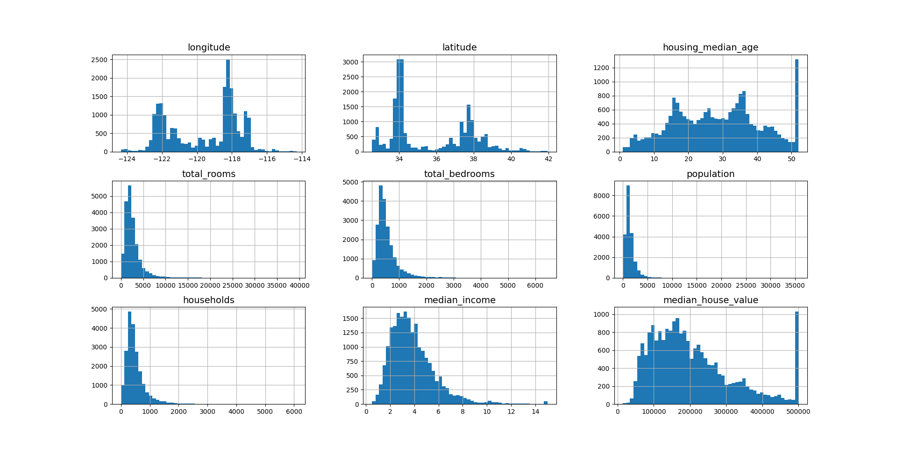
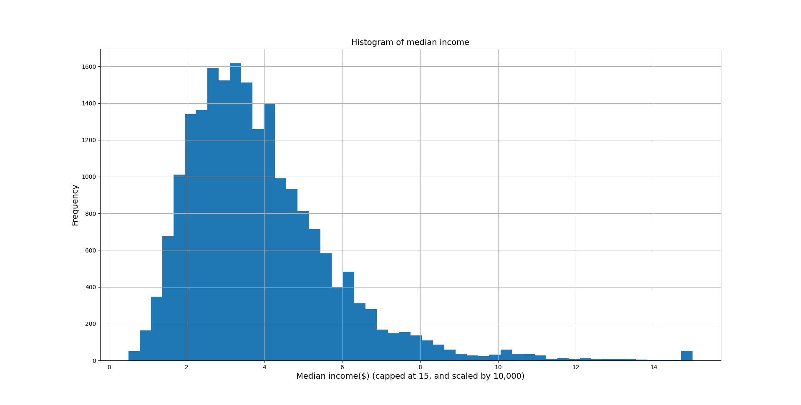
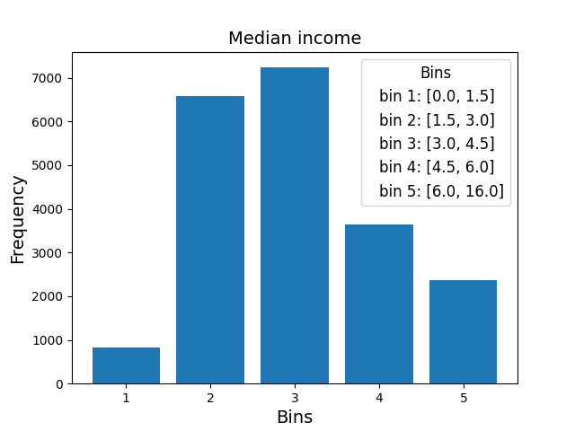
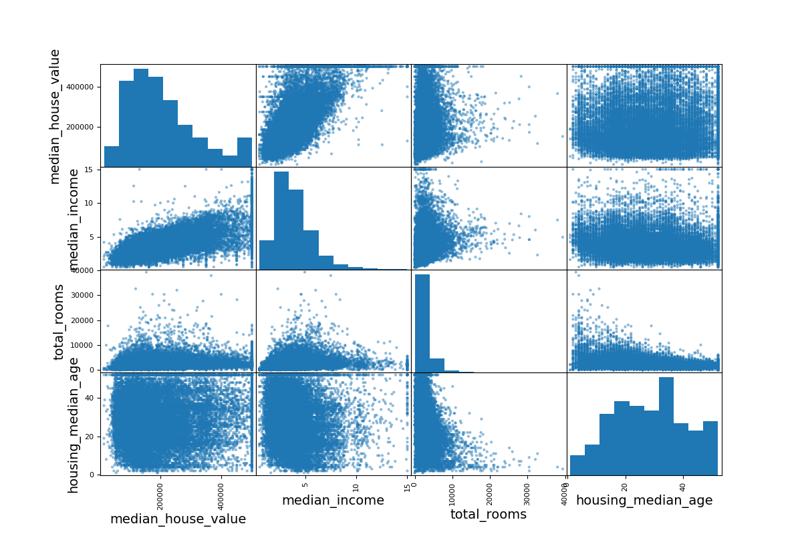
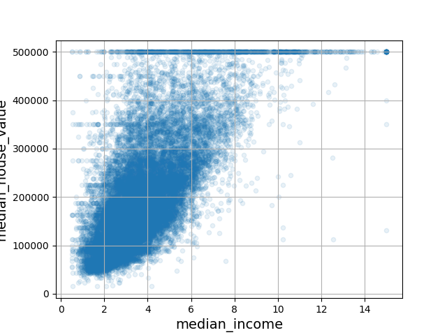

Results
=======

Running ``housing-prices plot-histograms`` gives:

Running ``housing-prices plot-histograms --column-name=median_income`` gives:

Running ``housing-prices stratify-column median_income --bins=0,1.5,3,4.5,6,16`` gives:

Running ``housing-prices geo-pop-scatter`` gives:

.. image:: images/geo-pop-scatter.png
   :alt: Scatter plot of population size and median house value
   :width: 100%

Running ``housing-prices scatter-plot median_house_value,median_income,total_rooms,housing_median_age``
gives:

Running ``housing-prices scatter-plot median_income,median_house_value`` gives:

